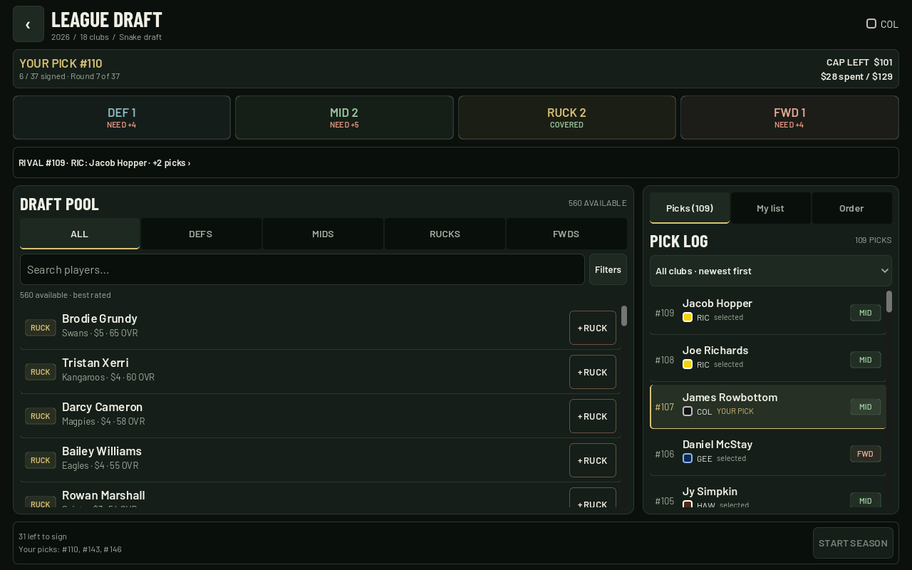
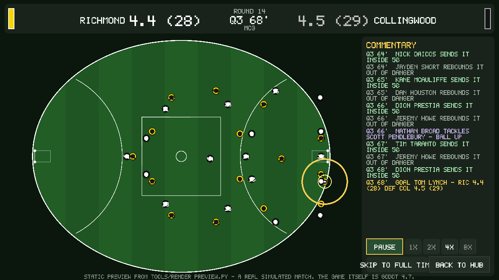

# AFL Auto-Battler

An auto-battler where the battles are **simulated AFL matches**. All 18 clubs
re-draft from a shared pool of 669 players using **2026 AFL player statistics**.
The current pool gives every club a 37-player list (up to 44 with a larger
pool). Then play a 24-round home-and-away season and a finals series, watching
every match on an animated top-down oval. When the season ends, the **national
draft** opens: keep your list, sign real 2026 draft-class prospects over the
reversed ladder, watch the whole league age and develop, and run it back.

Godot **4.7** / GDScript — targeting **PC and mobile**.

```
data/players_2026.csv      669 players, all 18 clubs, real 2026 season stats
data/draftees_2026.csv     the 2026 national-draft class - 56 prospects with
                           heights, ages, positions and reported U18 numbers
data/clubs.csv             club names, guernsey colours, home grounds
scripts/sim/               ratings model, match engine, squad, season, draft
scripts/core/              GameDB (data loader), Router (navigation)
scripts/state/             GameState (the season you are playing)
scripts/ui/                the oval animation and every screen
scenes/                    seven thin .tscn wrappers - all UI is built in code
tools/sim_harness.py       calibration harness (Python mirror of the engine)
docs/DESIGN.md             full design + engine docs  <- read this
```

## Running it

1. Install [Godot 4.7](https://godotengine.org/download) (the standard build, not
   the .NET one — this is pure GDScript).
2. Open the editor, click **Import**, select this folder's `project.godot`, **Open**.
3. Press **F5**.

That's it — there are no addons, no assets to build and no network calls.

**One thing to know about the CSVs.** Godot ships a `.csv` importer that treats
spreadsheets as translation files. That is not what we want here; `GameDB` reads
both CSVs directly with `FileAccess` at runtime. The checked-in
`data/*.csv.import` files pin the importer to **Keep File (exported as is)** so
the data survives export untouched. If Godot ever offers to re-import them as
translations, pick *Keep File* again in the Import dock.

## How a career plays

| Step | What happens |
|---|---|
| **Choose a club** | All 18 lists start empty. Choose your club with its randomly assigned first pick shown up front. |
| **The draft** | All clubs take turns from the same pool in snake order, under the same cap (58% of the cost of the best target-sized list). Track rival selections in the pick log. Carry at least two rucks; the other position targets are coverage guidance. Filter by position, original club or name, and sort by rating, price, goals or disposals. |
| **Home and away** | 24 rounds, a full double round-robin. Each round you can **Play Match** and watch it on the oval, or **Sim Round** and just read the results. |
| **Finals** | Top eight play the real AFL bracket: qualifying and elimination finals, semis, prelims, Grand Final at a neutral venue. Level scores are resolved by ladder position, exactly as the AFL does it. |
| **Review** | The flag, your record, best win, worst loss, longest streak and a game-by-game form strip. |
| **National Draft** | The career keeps going. Father-son and NGA prospects land at their clubs, then every list - yours included - drafts the 2026 class over the reversed ladder, worst club first. Prospects have no AFL stats; they arrive with **projected ratings** built from draft rank, position and U18 production, so a top pick starts rotation-grade and develops from there. |
| **Next season** | Every list ages: young prospects grow, veterans decline, the oldest retire. A generated intake class arrives each year, so the loop runs indefinitely. |

### The draft room

- **Rival picks are visible.** A latest-rival-pick strip links to the full log.
  The log includes the overall pick number, destination club, player and role;
  filter it by club or load earlier selections. Taken players also identify
  their drafting club when **Available only** is switched off under **Filters**.
- **Live position coverage.** DEF / MID / RUCK / FWD counters always show your
  actual totals and remaining needs. Tap a counter to filter the pool; tap it
  again to return to all positions. Targets are **5 DEF, 7 MID, 2 RUCK, 5 FWD**:
  the engine's on-ground structure plus the existing second-ruck requirement.
  Other than the two rucks, these are recommendations, not additional rules.
- **Portrait and landscape.** Portrait has Pool / Picks / My list / Order tabs.
  Landscape puts the pool beside the activity panel when there is enough width.
  Low-height layouts compact the header and scroll filters with the content.
  Rotation preserves the roster, history, search, sorting and filters.
- **Clear next steps.** Cap remaining, list progress and your next snake picks
  stay visible. **Start Season** only enables for a complete, valid list.
  Returning to the menu offers **Resume Draft** (for the current running session;
  this does not add save-to-disk support).

The draft UI uses locally bundled Barlow fonts, with SIL OFL licences under
`assets/fonts/`. No network access is required by the game.

Actual Godot captures after six user selections:

[Portrait draft](docs/draft-portrait.png) · [Landscape draft](docs/draft-landscape.png)



### The oval

`scripts/ui/PitchView.gd` draws the ground entirely with `_draw()` — no sprites,
no textures, so it scales cleanly from a phone to a 4K monitor. Mown stripes are
polygons clipped to the ellipse, and the 22 players on each side are the real
18 selected for that match, arranged 1 ruck / 7 mids / 5 defenders / 5 forwards
in club colours with their guernsey numbers.

The match is simulated in full before you see it, as a log of ~1,100 events
(every disposal, mark, tackle, inside 50, clanger and shot). The pitch replays
that log: the ball travels to the recorded field position, both structures shift
up and down the ground with it, the carrier is ringed in gold, and goals flare.
Routine handballs tick by quickly; scores and quarter breaks get room to land.
Speed controls run 1x–8x with a skip-to-full-time button — about ninety seconds
at the default 4x.

`docs/preview_match.png` is a static render of exactly this screen, frozen on a
real simulated goal, produced by `tools/render_preview.py` (which shares
PitchView's geometry constants and can also emit an SVG). It is what the game
draws, not a concept sketch:



## Simulation quality

The engine is calibrated against real 2026 numbers rather than guessed at.
`tools/sim_harness.py` derives per-team-per-game averages straight from the
harvested player data, runs hundreds of simulated matches, and reports the gap:

```
Stat / team / game     REAL 2026       SIM   ratio
------------------------------------------------
Score (pts)                 88.0      88.1    1.00
Goals                       13.1      13.3    1.01
Disposals                  364.6     363.6    1.00
Marks                       93.4      92.3    0.99
Inside 50s                  52.4      54.5    1.04
Clearances                  35.7      35.1    0.98
Hit-outs                    33.8      33.7    1.00
Free kicks for              18.0      17.9    1.00
```

Every ratio sits between 0.98 and 1.04. The derived player ratings independently
reproduce the real 2026 Brownlow ordering — Nick Daicos (a record 47 votes) →
Bailey Smith (36) → Patrick Cripps → Izak Rankine → Jordan Dawson →
Will Ashcroft.

The dataset itself is checked by `tools/validate_data.py`, which compares 220
club × column aggregates against the totals AFL Tables publishes. 219 pass; the
one failure is Hawthorn's Brownlow-vote column, which is off by 10 and is not
used by the ratings or the engine.

## The engine

```
Ratings.gd    real season stats -> 13 attributes on a 1-99 scale, a position
              classification, an overall rating and a draft salary value
Squad.gd      a 44-player list -> best 18 + bench -> the handful of team
              strengths the engine actually rolls against
MatchSim.gd   a match as 4 quarters of possession chains: stoppage, contest,
              carry, mark, tackle, inside 50, shot, clanger, free kick
Season.gd     24-round fixture (circle-method round-robin), ladder with the
              real AFL tiebreak order, and the full finals bracket
Draft.gd      the cap, snake draft, rival AI picks and shared pick history
```

Every match is seeded, so a result is reproducible. `MatchSim.gd` is a direct
port of `tools/sim_harness.py` and must keep the same RNG call order — that file
is where the constants were tuned, so **run the harness after any change to the
match engine**:

```bash
python3 tools/sim_harness.py               # calibration report
python3 tools/sim_harness.py --sample      # one narrated match
python3 tools/sim_harness.py --ratings     # dump ratings to data/ratings_preview.csv
python3 tools/validate_data.py             # dataset integrity check
```

## Exporting

**Desktop.** Project → Export → add *Windows Desktop*, *Linux/X11* or *macOS*,
then Export Project. Nothing here needs a native library, so the defaults work.

**Android / iOS.** Add the export preset, install the matching export templates,
and point the preset at your debug keystore (Android) or signing identity
(iOS). The project is already configured for mobile: the renderer is set to
`mobile`, ETC2/ASTC texture compression is on, and the window uses unrestricted
sensor orientation (portrait and landscape). `ScreenLayout` uses device density
to keep UI units readable instead of shrinking a 1280px canvas onto a phone.
The draft room reflows on resize and accounts for mobile safe-area insets.
Touch/mouse emulation is enabled both ways for fingers and cursors.

`export_presets.cfg` is deliberately not checked in: it holds machine-specific
paths and signing material. Generate it in the editor.

## Note

The draft update was run in Godot 4.7.2's web renderer, including touch input,
filtering, rival pick batches, a complete league draft, resume, season handoff,
and ten portrait/landscape viewport sizes. Model and container-layout regression
suites are in `tests/`; see [tests/README.md](tests/README.md) for commands and
remaining device checks. Native Android/iOS sensor rotation and safe-area insets
still need an on-device check.

The game starts in a fictional-label mode: players appear under generated random
names such as `Ari Bramble`, while their 2026 stats and ratings remain unchanged.
The main-menu **Player Labels** toggle adds an educational comparison (`Ari Bramble
· plays like ...`) when a player wants the real-world context. Club names remain
visible, but no club badges, guernsey designs or player imagery are reproduced —
guernseys are two
circles in each club's registered colours. This presentation choice is not legal
advice or a substitute for licensing review. See `docs/DESIGN.md` §1.
