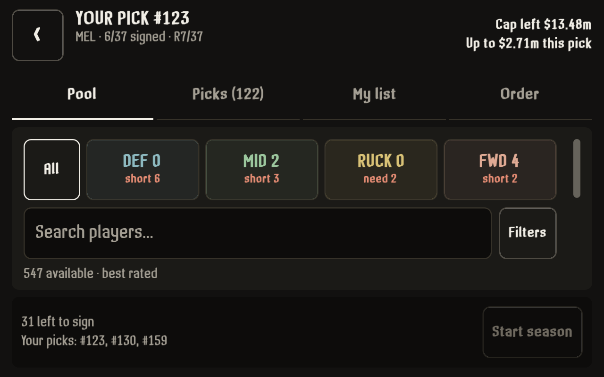
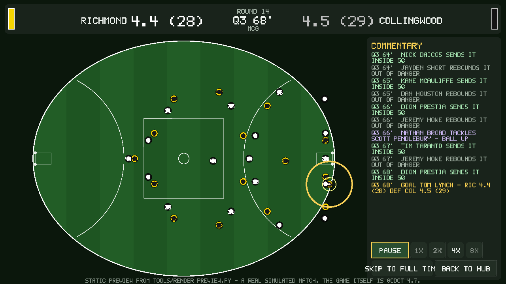

# AFL Auto-Battler

An auto-battler where the battles are **simulated AFL matches**. The
completed **2026 AFL season** is the foundation: 669 players rated from their
real 2026 statistics, their real careers through 2026, and the 2026 draft
class. A career takes over for the **2027 season**: all 18 founding clubs
re-draft that league - the 669 players plus the 56 prospects of the 2026
class - in the 2027 League Draft (40-player lists), then play a 24-round
home-and-away season and a 10-finalist wildcard finals series, watching every
match on an animated top-down oval. When the season ends, the **national
draft** opens: keep your list, sign the 2027 class over the reversed ladder,
watch the whole league age and develop, and run it back. Tasmania enters in
2028 and Canberra in 2030, each arriving with a generated list.

**Chronology.** Source data: the 2026 AFL season. Career start: 2027 (ages
are as of the start of 2027). Coaching source: the researched Round 1 2026
staff world, carried by continuity into the fictional 2027 starting world -
not a claim about real 2027 appointments.

Godot **4.7** / GDScript — targeting **PC and mobile**.

```
data/players_2026.csv      669 players, all 18 clubs, real 2026 season stats
data/draftees_2026.csv     the 2026 national-draft class - 56 prospects with
                           heights, ages, positions and reported U18 numbers
data/clubs.csv             club names, guernsey colours, home grounds
scripts/sim/               ratings model, match engine, squad, season, draft
scripts/core/              GameDB (data loader), Router (navigation)
scripts/state/             GameState (the season you are playing)
scripts/ui/                the oval animation and every screen
scenes/                    thin .tscn wrappers - all UI is built in code
tools/sim_harness.py       calibration harness (Python mirror of the engine)
docs/DESIGN.md             full design + engine docs  <- read this
```

## Career roadmap and research

[Canonical roadmap](docs/ROADMAP.md) · [Genre enjoyment research](docs/GENRE_ENJOYMENT_RESEARCH.md)

The intensive research now contains twenty named comparator sections and 171 cumulative sources (129 new), covering visual football, creative team building, understandable match decisions and coherent careers over decades. **Zero microtransactions; commercialisation is outside the objective. AFCM is not a visual aspiration.**

Read the [visual design research](docs/research/AFL_VISUAL_DESIGN_RESEARCH.md), [agency/team-building research](docs/research/AFL_AGENCY_AND_TEAM_BUILDING_RESEARCH.md), [long-career storytelling research](docs/research/AFL_LONG_CAREER_STORY_RESEARCH.md) and [source ledger](docs/research/AFL_RESEARCH_EVIDENCE_LEDGER.md). Existing roadmap owners are refined. Director review excluded RC-001/002 and accepted RC-003–007 within existing owners; the roadmap records the decisions and gates.

**Accepted future work, not current behaviour:** ARD-M5-016 will offer **Inherit 2026 lists** alongside the existing League redraft. It retains complete end-of-season 2026 club groups before later offseason changes, opens the 2026 National Draft and starts playable football in 2027. Complete rosters, source/pick provenance, a one-time opening handoff and save/Android checks are prerequisites. Research candidates await director selection.

## Running it

1. Install [Godot 4.7](https://godotengine.org/download) (the standard build, not
   the .NET one — this is pure GDScript).
2. Open the editor, click **Import**, select this folder's `project.godot`, **Open**.
3. Press **F5**.

That's it — there are no addons, no assets to build and no network calls.

**One thing to know about the CSVs.** Godot ships a `.csv` importer that treats
spreadsheets as translation files. That is not what we want here; `GameDB` reads
both CSVs directly with `FileAccess` at runtime. The checked-in
`data/*.csv.import` files pin the importer to **Keep File (exported as is)** so
the data survives export untouched. If Godot ever offers to re-import them as
translations, pick *Keep File* again in the Import dock.

## How a career plays

| Step | What happens |
|---|---|
| **Choose a club** | All 18 lists start empty. Choose your club with its randomly assigned first pick shown up front. |
| **The draft** | All clubs take turns from the same pool in snake order, under the real 2027 salary cap ($18.44m), the same cap the season uses. Track rival selections in the pick log. Carry at least two rucks; the other position targets are coverage guidance. Filter by position, original club or name, and sort by rating, price, goals or disposals. |
| **Home and away** | 24 rounds, a full double round-robin. Each round you can **Play Match** and watch it on the oval, or **Sim Round** and just read the results. |
| **Finals** | The top ten play a wildcard finals series: 7v10 and 8v9 in week one, with the winners reseeded by their original ladder position into the 7th and 8th seeds, who meet 5th and 6th in the elimination finals while 1-4 play the qualifying finals; then semis, prelims and the Grand Final. The higher seed hosts every final except the Grand Final, which is always at the MCG: there a club has its home-ground edge only if the MCG is its home ground (Collingwood, Hawthorn, Melbourne and Richmond), whichever club is listed first, and two MCG clubs cancel out. Your finals play live with the quarter-by-quarter coach box, just like a home-and-away match. A final level at full time goes to extra time (two short halves, then next score wins). After each final the game tells you where you stand: a second chance after a wildcard or qualifying loss, a week off, or knocked out. |
| **Team** | The best 23 by position (18 on the ground, five on the bench) are picked automatically, around injuries. Switch to **My selection** on the Team screen to name your own ruck, midfield, defence, forwards and bench, or leave players out. Gaps (an injury, a trade) are filled for you. |
| **Off-season** | After the Grand Final, **Trades & Contracts** opens: re-sign or release players whose contracts are up, sign free agents rivals let go, and offer trades. |
| **Review** | The flag, your record, best win, worst loss, longest streak, a game-by-game form strip, the season's awards, the honour roll and league records. |
| **National Draft** | The career keeps going. Father-son and NGA prospects land at their clubs, then every list - yours included - drafts that year's class over the reversed ladder, worst club first (the first is the generated 2027 class; the real 2026 class was already taken in the League Draft). Prospects have no AFL stats; they arrive with **projected ratings** built from draft rank, position and U18 production, so a top pick starts rotation-grade and develops from there. |
| **Next season** | Every list ages: young prospects grow, veterans decline, the oldest retire. A generated intake class arrives each year, so the loop runs indefinitely. Expansion follows the calendar: Tasmania (the Devils) enters in 2028 and Canberra (the Thunder) in 2030, each arriving with a generated list of 36 and joining fixtures, ladders, drafts, trades and the finals from its first season. With an odd club count the fixture rotates a bye so every club still plays 24 games. |

### Managing workload

Senior game time carries into the next week. Team selection shows **Fresh**,
**Carrying a load**, or **Needs a break**; tap a player for the explanation.
A loaded player starts with less in his legs, and a bench spell during the
match cannot completely remove the week's fatigue. Lighter game time helps;
leave him **Out** of your named side to give him a week away from seniors.
Byes and injury absences also allow recovery, and the offseason clears it.
Older players recover more slowly, while durability helps. Auto-pick weighs
freshness alongside ability for every club; a named selection remains yours.

### The draft room

- **Rival picks are visible.** A latest-rival-pick strip links to the full log.
  The log includes the overall pick number, destination club, player and role;
  filter it by club or load earlier selections. Taken players also identify
  their drafting club when **Available only** is switched off under **Filters**.
- **Live position coverage.** DEF / MID / RUCK / FWD counters always show your
  actual totals and remaining needs. Tap a counter to filter the pool; tap it
  again to return to all positions. Targets are **6 DEF, 6 MID, 2 RUCK, 6 FWD**
  (the 6-6-6 shape counts the ruck with midfield): the engine's on-ground
  structure plus the second-ruck requirement. Other than the two rucks, these
  are recommendations, not additional rules.
- **Portrait and landscape.** Portrait has Pool / Picks / My list / Order tabs.
  Landscape puts the pool beside the activity panel when there is enough width.
  Low-height layouts compact the header and scroll filters with the content.
  Rotation preserves the roster, history, search, sorting and filters.
- **Clear next steps.** Cap remaining, list progress and your next snake picks
  stay visible. **Start Season** only enables for a complete, valid list.
  Returning to the menu offers **Resume Draft**, and the draft is saved to disk
  with the rest of the career (see *Saving* below).

The draft UI uses locally bundled Barlow fonts, with SIL OFL licences under
`assets/fonts/`. No network access is required by the game.

Actual Godot captures after six user selections:

[Portrait draft](docs/draft-portrait.png) · [Landscape draft](docs/draft-landscape.png)



### The oval

`scripts/ui/PitchView.gd` draws the ground entirely with `_draw()` — no sprites,
no textures, so it scales cleanly from a phone to a 4K monitor. Mown stripes are
polygons clipped to the ellipse, and the players on each side are the real
18 selected for that match, arranged 6-6-6 — six defenders, six midfielders
(ruck included) and six forwards — in club colours with their guernsey numbers.

The match is simulated in full before you see it, as a log of ~1,100 events
(every disposal, mark, tackle, inside 50, clanger and shot). The pitch replays
that log: the ball travels to the recorded field position, both structures shift
up and down the ground with it, the carrier is ringed in gold, and goals flare.
Routine handballs tick by quickly; scores and quarter breaks get room to land.
Speed controls run 1x–8x with a skip-to-full-time button — about ninety seconds
at the default 4x.

`docs/preview_match.png` is a static render of exactly this screen, frozen on a
real simulated goal, produced by `tools/render_preview.py` (which shares
PitchView's geometry constants and can also emit an SVG). It is what the game
draws, not a concept sketch:



## Simulation quality

The engine is calibrated against real 2026 numbers rather than guessed at.
`tests/run_calibration_tests.gd` plays 400 seeded matches of the shipped
engine between the real 2026 lists and compares per-team-per-game totals with
the real 2026 averages derived from the harvested player data
(`tools/sim_harness.py` is the Python mirror used for tuning):

```
Stat/team/game   REAL 2026      SIM  ratio
Score (pts)           87.2     87.4   1.00
Goals                 12.9     12.9   1.00
Behinds                9.5      9.8   1.03
Disposals            367.6    364.0   0.99
Marks                 91.7     92.0   1.00
Tackles               57.4     56.0   0.98
Inside 50s            53.1     52.1   0.98
Clearances            36.1     37.2   1.03
Hit-outs              35.8     37.1   1.04
Rebound 50s           39.3     37.6   0.96
One percenters        42.6     42.1   0.99
Clangers              55.9     55.8   1.00
Free kicks for        18.7     18.7   1.00
Top kicker share      0.16     0.15   0.96
Top-3 share           0.38     0.41   1.07
```

Team stats sit within 4%, and so does how goals spread across a side (a
club's top goalkicker kicks about 16% of its goals, as in 2026 - which keeps
the Coleman in the 60s rather than the 130s). CI fails if a team stat drifts
past 7% or the spread past 15%.

**Long careers stay balanced.** Training, development and new draftees lift
the whole league a little every year. Ratings are therefore relative to the
league: after each off-season every player is shifted so the league mean is
back where 2026 started (`Prospects.renormalise_league`), keeping everyone's
position relative to everyone else, while potentials stay put so the elite
tail survives. `tests/run_balance_tests.gd` simulates three full seasons with
drafts and fails if the mean or the top-50 drift.

The derived player ratings independently
reproduce the real 2026 Brownlow ordering — Nick Daicos (a record 47 votes) →
Bailey Smith (36) → Patrick Cripps → Izak Rankine → Jordan Dawson →
Will Ashcroft.

The dataset itself is checked by `tools/validate_data.py`, which compares 220
club × column aggregates against the totals AFL Tables publishes. All 220 pass
(a player-by-player comparison with the live 2026 page also matches every
stat). CI runs it on every pull request.

## The engine

```
Ratings.gd    real season stats -> 13 attributes on a 1-99 scale, a position
              classification, an overall rating and a draft salary value
Squad.gd      a 44-player list -> best 18 + bench -> the handful of team
              strengths the engine actually rolls against
MatchSim.gd   a match as 4 quarters of possession chains: stoppage, contest,
              carry, mark, tackle, inside 50, shot, clanger, free kick
Season.gd     24-round fixture (circle-method round-robin), ladder with the
              real AFL tiebreak order, and the full finals bracket
Draft.gd      the cap, snake draft, rival AI picks and shared pick history
```

Every match is seeded, so a result is reproducible. `MatchSim.gd` is a direct
port of `tools/sim_harness.py` and must keep the same RNG call order — that file
is where the constants were tuned, so **run the harness after any change to the
match engine**:

```bash
python3 tools/build_history.py             # draft pedigree + rated 2021-25 seasons
python3 tools/sim_harness.py               # calibration report
python3 tools/sim_harness.py --sample      # one narrated match
python3 tools/sim_harness.py --ratings     # dump ratings to data/ratings_preview.csv
python3 tools/validate_data.py             # dataset integrity check
```

## Training

Every player on your list earns XP after every game (more for playing, more
for a big game). Each player follows a **training plan** that spends it
automatically after the game:

- **Club plan** - the plan for anyone without his own. New careers start on
  **Position plan**, which trains what each position needs (the same
  priorities rival clubs use).
- **Role plans** - inside midfielder, outside runner, key defender,
  rebounding defender, key forward, small forward, ruck, star power.
- **Focus: <stat>** - every point into one stat.
- **Manual** - bank the XP and spend it yourself.

Change the club plan or any player's plan at any time in Training; banked XP
is spent under the new plan straight away. You can still buy any stat by
hand. The results and full-time screens say what the plans bought.

**Stat guide.** Training's *Stat guide* button (also on the main menu under
How to play) explains all 13 stats: what each is built from, exactly what it
does in a match, and who needs it - plus how overall, potential, XP and plans
fit together. Training shows a short intro the first time you open it.

## Potential

Every player has a **potential (POT)**: the rating he can grow into. It shows
beside the rating on your list, in Training (with his draft pedigree and
recent seasons) and on the draft board, which can also sort by
**Highest potential**.

- **Draftees** get more room the earlier they rank: about +22 above their
  projection for the top pick, about +8 at the end of the class.
- **AFL players** get the highest of: age headroom (+16 at 20, +8 at 24,
  nothing from 29); their **recent peak**, the best 2023-25 season (8+
  games) rated with the same model, eased a little past 29; and their
  **draft pedigree**, which pulls a young national-draft pick's ceiling
  toward what that pick is expected to become (pick 1 about 90, pick 30
  about 81), fading out by 25.
- **Injured stars.** A player on fewer than 12 games in 2026 who rated 12+
  higher in a recent season is rated on a small sample, not his real level.
  He gets a **rehab year**: at the next rollover he closes 90% of the gap to
  his POT, whatever his age. The shipped data finds Connor Rozee, Darcy Moore
  and Sam Darcy (among others) this way.

Each off-season a player 28 or under closes part of the gap to his POT
(30% at 21, 15% by 28) instead of following the plain age curve, and never
grows past it. Training is up to half price below POT and 50% dearer above it.
`data/potential_overrides.csv` (club, first, last, potential) sets a POT by
hand for anyone the data gets wrong.

## Position scales

A rating is built from stats, and the stats that drive it (disposals,
Brownlow votes) are midfield stats. Left alone, the best key defender in 2026
rated 72 against a 92 midfielder, with the medians level. `Ratings.position_stretch`
re-anchors each position: its median sits on the midfield median and its 98th
percentile most of the way to the midfield one, so the elite of every
position reach the high 80s (Wilkie 88, Treacy and Greene 87, Gawn 88). The
stretch keeps the order within a position, so team selection and the match
engine (which rolls attributes, not ratings) are unchanged.

## Rival clubs

**Drafting.** Rivals value a player by *worth over replacement*: his rating
blended with his potential (25% in the career draft, 65% in the national
draft), minus the best player the club can still expect in that position at
its next pick. Scarce positions go early (the elite rucks are taken in
round one), deep ones wait. An open starting spot counts in full, depth up to
a balanced list 60%, surplus 20%; every club ends the career draft with two
or three rucks, and the salary cap only bites when a pick would starve the
rest of the list.

**Scouting opinions.** In the career draft no two rival clubs rate players
identically. Each club sees every player through its own fixed opinion of
him: his worth plus an error that belongs to that club and that player.
The error is zero on average, so no club rates everyone up or down. It
counts in full for a starting spot the club is filling, less for depth,
and little for surplus. Clubs also differ in how sharp their scouting is:
the typical error is 1-5 rating points depending on the club. Everything
comes from the draft seed, so a draft replays identically. The opinions
change only which players rivals pick. They never change a player's ratings, the draft
board you see, the salary cap or your own picks. The national draft keeps
one shared valuation. See [docs/DRAFT_EVALUATION.md](docs/DRAFT_EVALUATION.md).

**Training.** Rival players earn XP from every game on the same scale as
yours, and their coaches spend it on the stats that matter for the position
(disposal and contested ball for midfielders, intercepts and marking for
defenders, goalkicking for forwards, ruck work for rucks). Rivals train a
player only up to his potential; you can push past it, at a premium. A
rival gains at most 2 rating points a season from training on Normal (see
Difficulty).

## Match day: moments, legs and gameplans

Live matches are played, not just watched:

- **Coach's calls.** The match stops for decisions, each with its odds:
  - A set shot: take it, play on to a teammate, or bomb it to the goal square.
  - A star running on empty: rest him or keep him on.
  - Their forward kicking a bag: tag him or back your defenders.
  - A run of goals against: throw numbers at it, slow it down, or ride it out.
  - A tight last-quarter centre bounce: stack it, flood back, or play it straight.

  There are about six a game. Skipping takes the default call.
- **Legs.** Players tire on the ground and recover on the bench, faster with low durability and on high-tempo plans. Tired players play below their rating, and a tired midfield loses the stoppages. Coaches rotate automatically. The coach box sets the policy (rotate hard, normal, ride the stars) and says who is running on empty.
- **Gameplans are trade-offs with counters.** Attack corridor beats Controlled tempo, Controlled tempo plays through the Defensive press, and the press squeezes Attack corridor. Measured over 1,200 games per pairing, every plan is within about 2.5 points of Balanced, and each counter wins by 3–7. The rival coach protects leads, chases deficits, tags your best player after half time, and counters a plan you run twice in a row.
- **What your calls did.** Each quarter break says what happened - the stoppages, the ball going forward, who hurt you, how your tag and your calls came off - without telling you what to do next. At full time the readout shows the expected points your gameplan, pep talk, legs, calls and synergies added or cost, and theirs too. The numbers come from the probabilities each call changed, with no extra dice.

## Traits and synergies

A standout stat earns a trait. Each player has up to two good traits, plus Hothead for poor discipline, and each trait has one match effect:

| Trait | Effect |
|---|---|
| Ball magnet | 10% more of the ball in general play |
| Contested bull | 15% more clearances; keeps the ball when tackled more often |
| Ruck king | 5% more hit-outs |
| Aerial threat | 6% more forward-50 marks |
| Crumber | 12% more goals from ground balls |
| Sharpshooter | +6% goal chance |
| Playmaker | shots from his deliveries +5% |
| Interceptor | 5% more spoils |
| Lockdown | his opponent's shots −4% |
| Engine | tires 25% slower |
| Big-game player | +5% on every stat in the last quarter and in finals |
| Hothead | 50% more clangers |

Traits follow the stats, so training can unlock one; the Training screen shows how close a player is. The right mix of traits across the selected 18 switches on a **synergy**:
- Engine room: 2 bulls
- Tall-small forward line: an aerial forward and a crumber
- Intercept wall: 2 interceptors in defence
- Lockdown unit: 3 lockdowns
- Supply line: 2 ball magnets and a playmaker
- Running machine: 3 engines

The Team screen lists active synergies and the nearest ones to finish. The draft rows show traits too. The engine still calibrates within 4% of real 2026 numbers with all of this switched on.

## The board, morale and the week

- **The board.** Each season it sets a goal from where your list ranks: top four, make the finals, top 12, or win seven games. Every result moves its confidence (shown on the hub). At season's end, meeting the goal adds 20, missing it costs 25, and a flag adds 30. End a season under 30% and you get a final warning. Do it again and you're sacked, and the career is over.
- **Morale.** Playing lifts a player's morale, and a win lifts it more. A fit player left out loses some, and a star left out loses more. Morale nudges form (±3%), and an unhappy player asks 25% more to re-sign. It shows on the List and Team screens.
- **This week.** Most weeks bring a decision on the hub. Each is a trade-off a coach could make either way, depending on the week:
  - **A sore player:** rest him, or play him short of a gallop with several times his usual injury risk (the card gives his odds).
  - **An extra session:** a heavy week (XP for everyone, heavy legs and more soft-tissue risk on game day, worth about 1.7 points a game) or a recovery week (fewer injuries, a lift).
  - **An open training day:** the board and the group enjoy it, or a closed session builds XP.
  - **A player in the papers:** suspend him (the board approves, he misses the game) or back him (he lifts, the board does not).
  - **A contract:** extend a good player early at a premium for certainty, or wait and pay whatever his rating is worth at season's end (less if he drops, more if he improves). Only offered when the cap can carry it, once a season per player.
  - **The board after a losing run** (three and six straight losses): promise a win, or ask for patience.
  - **A young gun pushing for games:** give him a senior game (the best development there is, if you pick him) or a week with the development coaches (less than a senior game, more than the reserves, no game at all).
  - **An unhappy player:** sit down with him (he expects a game) or tell him to earn it. Never for an injured player, and not the same player again within five rounds.

  The same card never comes twice in a row when another is due. An unanswered card takes its default when the round is played.

## Injuries

After every game each player who took the field has a small chance of an
injury: 4.2% at base, scaled by durability from about half that (99
durability) to 1.3x (low). Most injuries cost 1-2 weeks; knees and shoulders
can end a season. Injured players are left out automatically (your own
selection's gaps are filled), show as INJ on the List and Training screens,
and everyone heals over the off-season. Injuries are seeded per match, so a
replayed season is identical.

## Awards and records

Every game feeds a running tally that survives saving:

| Award | How it is decided |
|---|---|
| Brownlow Medal | 3-2-1 votes to the three most influential players in each home-and-away match |
| Coleman Medal | Most home-and-away goals (the live leaders are on the Ladder screen) |
| Rising Star | Best votes, then influence, among players 21 and under (8+ games) |
| Best & fairest | 5-4-3-2-1 within each side every match, finals included |
| All-Australian | The season's best by position (1 ruck, 7 mids, 5 defenders, 5 forwards, 4 bench; 12+ games) |

The Season Review shows the awards, an honour roll of every season in the
career (premier, runner-up, medallists, your club's best and fairest) and
league records: most goals, most votes, highest score, biggest win.

## Contracts, free agency and trades

Every player has a contract (seasons left) and a salary in dollars. Every
club's payroll counts against the salary cap: $18.44m in 2027, the cap the league
draft used, then growing about 3% a year. When the season
ends, contracts in their final year are up: rivals keep players worth their
new price and release the rest into free agency, and you decide yours on
**Trades & Contracts** (re-sign for 1-4 seasons at today's price, or
release). Anything you leave undecided is re-signed for two seasons if the
cap allows. Sign free agents while there is cap room and list space (32-44
players). Trades are valued by the other club: stars are worth far more than
two middling players, a club pays more for a position it is short in, and it
has to come out ahead (the margin depends on difficulty). Drafted rookies
start on two-season rookie deals.

## Difficulty

Chosen in the New Career setup (after the main menu's **New career**, before
choosing a club), and saved with the career:

| | Rival training per season | Trade margin | Your match XP |
|---|---|---|---|
| Easy | up to +1 | none (fair value) | +25% |
| Normal | up to +2 | 4% | as tuned |
| Hard | up to +4 | 12% | -15% |

## League news

The hub's **League news** card shows the latest headlines, and **More**
opens the whole feed: big games (6+ goals or 40+ disposals), long injuries
to good players, the round's biggest rival improver, releases, signings and
trades, retirements, the medallists and the premiers.

## Saving

The career autosaves to `user://career.save`: after every round and every
match you play, when a season or national draft starts or finishes, on screen
changes after training or draft picks, and whenever the app is sent to the
background or closed. **Continue** on the main menu picks it up, showing the
club, year and stage. **New career** opens a short setup (player names,
difficulty); starting from it asks before replacing a saved career. A match is
never saved half played: if the app dies mid-match, you replay that round
(the other results are seeded, so they come out the same).

`scripts/state/CareerSave.gd` writes one `store_var` blob. Player dictionaries
are shared by reference all over a career (season lists, your list, the draft,
the prospect pool), so each is written once and relinked on load. Match event
logs and the derived `rates`/`norm` tables are not saved. A mid-season save is
about 1.4 MB. The "Player names" choice is kept separately in
`user://settings.cfg`.

## Back button

Android's back button and Escape on desktop go through `Router.handle_back()`
(`application/config/quit_on_go_back` is off). A screen can intercept it first:
the hub closes its results popup, the main menu closes help, Settings, the New
Career prompt or the setup, and a live match refuses to be abandoned until full time. Otherwise it
steps back a screen; from the hub it returns to the main menu with the career
kept in memory. Only the OS back button on the main menu quits the app.

## Exporting

**Desktop.** Project → Export → add *Windows Desktop*, *Linux/X11* or *macOS*,
then Export Project. Nothing here needs a native library, so the defaults work.

**Android / iOS.** Add the export preset, install the matching export templates,
and point the preset at your debug keystore (Android) or signing identity
(iOS). The project is already configured for mobile: the renderer is set to
`mobile`, ETC2/ASTC texture compression is on, and the window uses unrestricted
sensor orientation (portrait and landscape). `ScreenLayout` uses device density
to keep UI units readable instead of shrinking a 1280px canvas onto a phone.
The draft room reflows on resize and accounts for mobile safe-area insets.
Touch/mouse emulation is enabled both ways for fingers and cursors.

`export_presets.cfg` is checked in: it holds the Android Debug preset described
below, with no keystore, password or SDK path in it. Those stay in the editor's
settings on each machine.

## Note

The draft update was run in Godot 4.7.2's web renderer, including touch input,
filtering, rival pick batches, a complete league draft, resume, season handoff,
and ten portrait/landscape viewport sizes. Model and container-layout regression
suites are in `tests/`; see [tests/README.md](tests/README.md) for commands and
remaining device checks. Native Android/iOS sensor rotation and safe-area insets
still need an on-device check.

The game shows real AFL names by default (`Jordan Dawson`): the name alone, not a
"plays like" comparison. **Player names** (in the New Career setup, or Settings
on the main menu) switches to generated fictional labels such as `Ari Bramble`
instead; ratings and results are the same either way, and a choice you make is
kept. Numbered placeholders are never used. Generated prospects and custom
players keep the names they were given. Club names remain
visible, but no club badges, guernsey designs or player imagery are reproduced —
guernseys are two
circles in each club's registered colours. This presentation choice is not legal
advice or a substitute for licensing review. See `docs/DESIGN.md` §1.


### Android debug export

The repository includes an `Android Debug` export preset for the phone playtest build. It exports an ARM64 APK as `builds/aussie-rules-dynasties-debug.apk` with package ID `com.gabebartolo.aussierulesdynasties`.

After configuring Godot's Android SDK/JDK paths on the development machine:

```bash
godot --headless --path . --export-debug "Android Debug"
```

Godot's local debug keystore/export credentials are intentionally not committed. APK/AAB output and the `builds/` directory are ignored.
