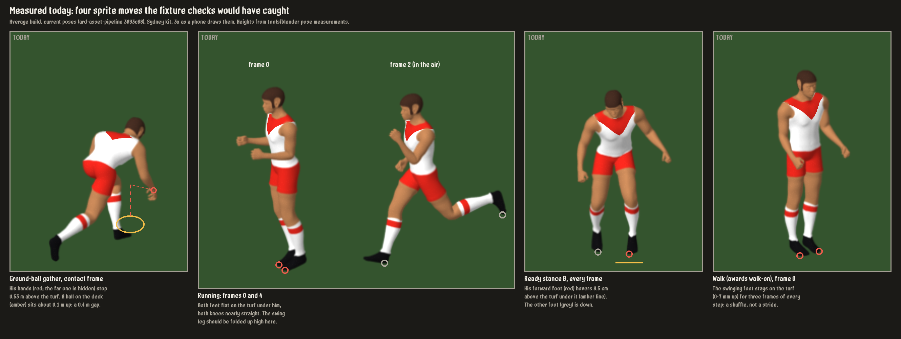

# Animation pipeline proposal: the two animation briefs on our sprite pipeline

**Status:** research and proposal only. No game code changes. Written by the art agent, 2026-10-07, at the
director's choice "Art adapts them to our pipeline". The lead builds the match-event contract (brief
sections 9-10) from this after the Stats patch and the mid-season draft.

**Inputs:**
- *Aussie Rules Dynasties: Animation Automation Research Brief* (the AFL brief).
- *AI Game Animation: Local-First Research & Automation Brief* (the general brief).
- Plain-text copies of both are in agent-handoffs.
- Every sprite move measured on the rig (`ard-asset-pipeline/tools/blender/clip_probe.py`).
- The vignette scene code on main (21da7002).
- `ard-asset-pipeline/docs/afl_reference.md` and `docs/tripo_research.md`.

## In short

- **Keep the briefs' core.** One frozen skeleton, a small shared motion library, motion from real
  reference instead of text prompts, and every move checked automatically before it ships.
- **Swap out their 3D runtime.** ARD-M8-007 rules out 3D player models in the game. So Godot's
  AnimationTree, SkeletonModifier3D and GLB characters are out. Our footballers stay pre-rendered 2.5D
  sprites. The briefs' corrections happen offline in Blender, and the game lines the ball and timing up
  using data shipped with each sprite strip.
- **Every strip will carry its own facts:**
  - the frame of each contact moment (foot plant, ball release, ball contact, gather, mark);
  - the ball's anchor points on every frame (palms and boot);
  - which directions it was rendered from, and its kicking foot or hand, so mirroring never swaps a
    right-footer onto his left foot;
  - the shortest and longest time each part of the move may take.
- **Measuring today's moves found six defects.** Four show in still frames
  ([measured_today.png](animation/measured_today.png)) and two only in motion:
  1. The ground-ball gather's hands stop 0.4 m above the ball.
  2. The run's passing frames have both feet flat on the turf with straight legs.
  3. One ready stance has a foot hovering 8.5 cm up.
  4. The walk shuffles.
  5. Every dropped ball (set shot, snap, crumb) falls from hand to boot in 0.08-0.10 s. Gravity needs
     0.2-0.35 s.
  6. Run cycles play up to 2.7 times faster than the ground the player covers.
- **First proof, recommended:** one chain of gather on the run, carry, then drop punt. It covers three
  body sizes and four directions, with right- and left-footers, and is checked by fixtures before you
  see it.



## 1. What the briefs ask for, and how it fits our game

| Brief | Our version | Why |
|---|---|---|
| One standard humanoid skeleton | The MPFB `game_engine` rig every build already uses (average 1.88 m, ruck 2.03 m, small 1.78 m, coach). Tripo bodies follow it (`tripo_body.follow`). Freeze its bone names, rest pose, scale and the anchor points below. | Already true in practice; the brief makes it a contract. |
| A curated football motion library | `poses.py` stays the library: code, one function per move. Moves get re-keyed from reference, and the tables become data. | Already code-first, which is what the brief likes about a Three.js lab. |
| Retarget motion; don't generate it | Retarget only captured or reference motion, offline in Blender. `arm_solve.py` already solves arms to palm targets; extend it to feet and ball targets. | |
| Godot AnimationTree, SkeletonModifier3D, GLB characters | **No.** Pre-rendered strips plus per-frame data. Scenes pick the strip, frame and mirror from the event. | ARD-M8-007: "Do not introduce 3D player models". |
| Section 8 corrections (gaze, hands to ball, facing, grounding, stride phase) | **Offline:** hands reach the ball and feet stay on the turf in the pose itself. **In game:** the ball is drawn at the frame's anchor, facing is the nearest rendered direction plus mirror, and playback speed comes from ground speed. | Sprites can't bend at runtime, so the pose must be right before it's rendered. |
| Named markers (gather_contact, ball_release, ...) | Per strip, in `frames.json` and then the generated `VignetteFigures.gd`. | Replaces hand-measured constants such as `KICK_BOOT`, `SNAP_BOOT` and "contact on frame 3". |
| In-place clips; no root motion | Already in place: the game moves the figure. | |
| Fixture matrix and automated captures | Two layers: pipeline checks on every strip at every build (§10), and game fixtures for directions, quarters and timing (lead). | |
| Three.js staging lab | **Not now.** | Our passes (shade, masks, design) must render in Blender anyway. A second rig evaluation adds retarget and rest-pose risk for no gain. Node 24 is installed if Blender IK ever proves awkward. |
| Local AI video (AnimateDiff, Wan, FramePack, LTX) | **No.** | Pixels would break per-club recolouring and the mask passes. This PC is the 12 GB tier. No model downloads. |
| FreeMoCap, reference footage, pose extraction | **Yes, owned footage only** (§9). | AFL hand-and-ball moves need real reference; text-to-motion failed (§9). |
| Licence register | §9 and the provenance rule. | |

## 2. This machine (the general brief's Phase 0)

| | |
|---|---|
| GPU | NVIDIA RTX 4070 SUPER, 12 GB VRAM, driver 617.14 |
| CPU and RAM | AMD Ryzen 7 9700X (8 cores), 31 GB |
| Free disk | C: 85 GB of 931 GB; D: 375 GB of 931 GB |
| Tools | Blender 5.2.2 LTS; Godot 4.7.2; Node 24.21.0; Python 3.14.7; comfy-cli 1.22.0 |
| ComfyUI | v0.38.0 (Stability Matrix install). Not running; v0.39.1 is out. Not needed for this plan. |

In the general brief's ladder this is the 8-12 GB tier. Local video models would be slow and they aren't
needed: every step here is Blender, Python or Godot. **No large downloads are proposed.**

## 3. What each strip will carry

These fields are generated by the pipeline into `frames.json`, then by `combine_sheets.py` into
`VignetteFigures.gd`, next to today's `frames`, `pivot`, `reach` and `hair`:

```
"kick": {"back_r": {
    ...today's fields...,
    "markers": {"foot_plant_l": 0, "ball_release": 2, "ball_contact": 3},
    "anchors": {"palm_l": [[x, y], ...], "palm_r": [...], "instep_r": [...],
                "feet": [[lx, ly, l_down, rx, ry, r_down], ...]},   # pixels in the frame, per frame
    "side": "R",              # kicking foot or hand as rendered; mirrored = the other side
    "time": {"segments": [[0, 2, 0.20, 0.45], [2, 3, 0.20, 0.30], [3, 5, 0.25, 0.45]],
             "hold": {"0": "set_shot_only"}},
    "metres_per_frame": null   # cycles only: ground covered per frame at a natural stride
}}
```

**Marker meanings** (frame numbers count from 0):

| Marker | The frame where |
|---|---|
| `foot_plant_l` / `foot_plant_r` | that foot first rests on the turf (its lowest point is under 1 cm) after being off it |
| `ball_release` | the ball first leaves the hand (from here the game draws it in flight) |
| `ball_contact` | the boot or fist meets the ball |
| `gather_contact` | the hands reach a loose ball |
| `mark_secure` | the hands close on the ball in a mark |
| `tackle_contact` | the tackler's arms close on the carrier (no clip yet) |
| `bounce_contact` | the ball meets the turf in a bounce. The ball's own physics decides this, after `ball_release`; the strip says which frame the hand is ready for it again. |

## 4. Contact frames today (measured)

Measured on the average build with `clip_probe.py`. The small and ruck builds use the same pose functions,
so their frames match; only their anchor positions differ. Heights are above the turf.

| Strip (frames) | Foot plants | Ball release | Ball contact | Gather | Mark | Notes |
|---|---|---|---|---|---|---|
| `jog`, the run (8, loop) | L 0, R 4 | | | | | **Both feet flat on the turf at 0 and 4** with both knees ~15 degrees bent (defect, §7) |
| `carry` (8, loop) | L 0, R 4 | | | | | Same legs as `jog`. Palms 0.55 m apart, 1.27-1.36 m up (§7) |
| `walk`, `coach_walk` (8, loop) | R 2, L 6 | | | | | Swing foot on the turf in frames 7, 0, 1 (R) and 3, 4, 5 (L) (defect) |
| `idle`, `ready`, `ready_turn`, `ready_b` (1 or 3) | both down | | | | | `ready_b` forward foot 8.5 cm up; `ready` 2 cm (defect) |
| `kick`, drop punt, right foot (6) | support L down from 0 (design says 1) | 2 (hand 1.02 m up) | 3 (instep 0.37 m up) | | | Matches `docs/afl_reference.md`: contact low, below the knee |
| `snap`, right foot (5) | support L down throughout | 1 | 3 (instep 0.59 m up) | | | |
| `gather`, standing crumb (3) | L down throughout | | | 1 | | **Palms 0.53 m up at contact**; a ball on the deck sits ~0.1 m up (defect) |
| `leap`, mark (6) | both down in the strip (the game adds the jump) | | | | 4 | Palms 0.20 m apart, 2.17 m up at 4 and 5 |
| `tap`, ruck, right hand (6) | both down | | 5 | | | Full reach 2.09 m from 4; the game shows 5 at the top |
| `tap_b`, ruck, left fist (4) | both down | | 3 | | | 2.03 m |
| `bounce`, umpire (4) | both down | 3 (at its start) | | | | 2026 Laws replace the bounce with a throw-up (`afl_reference.md`) |
| `lunge`, smother (3) | L down | | 2 if a smother is shown | | | |
| `celebrate`, `coach_sit`, `coach_seated` | | | | | | No contacts |

There's no tackle, handball or running bounce yet, so no `tackle_contact` or player `bounce_contact`.
See §8.

## 5. Facings and mirroring

**Direction convention.** A move's direction is the camera-relative angle the player faces or moves on the
ground: 0 means facing the camera, 90 heading screen-left, 180 facing away and 270 heading screen-right.
These are `build_sprites.FACINGS`: `front` 0, `side_l` 70, `back` 180, `back_r` 215, `front_r` 325.
Mirroring maps an angle *a* to 360 - *a*, giving `side_r` 290, `back_l` 145 and `front_l` 35. With all
five rendered facings plus mirroring, all eight directions are within 20 degrees. Most strips have only one
or two facings.

| Strip | Builds: rendered facings | With mirroring | Side | Mirror rule |
|---|---|---|---|---|
| `jog` | average, small: 0, 70, 180, 215. Ruck: 0, 180 | adds 145, 290 | none | Mirror freely; the foot-plant labels swap |
| `carry` (held-ball branch, #506) | average, small: 70, 215 | adds 145, 290 | none | freely |
| `walk`, `coach_walk` | average, coach: 325 | adds 35 | none | freely |
| `idle`, `ready`, `ready_turn`, `ready_b` | all builds: 0, 180 (`idle`: average and ruck) | same | none | freely (`ready_turn` mirrored looks the other way, as designed) |
| `leap` | average: 0, 180. Small: 180 | same | knee only | freely |
| `tap` / `tap_b` | average, ruck: 0, 180 | same | right hand / left fist | allowed: rucks use either hand |
| `kick` | average, small: 215 | 145 | **right foot** | **A mirrored kick is a left-foot kick.** Mirror only for left-footers |
| `snap` | average, small: 215 | 145 | **right foot** | as `kick`. The crumb scene mirrors it for every player today |
| `gather` | average, small: 215 | 145 | none | freely |
| `lunge` | average: 70 | 290 | none | freely |
| `bounce` (umpire) | average: 0 | | none | |

**How a scene should choose** (for the lead's contract):
1. Take the heading from the event (target vector or velocity), relative to the scene's camera.
2. The candidates are each rendered facing (not mirrored) and its mirror.
3. For a strip with a side (`kick`, `snap`, a future handball), keep only the candidates whose side
   matches the player: rendered means right-footed, mirrored means left-footed.
4. Take the nearest candidate.
5. If none is within 35 degrees, that direction is a coverage gap. The fixture fails and the scene stages
   the shot another way. It never shows a wrong-way or wrong-foot kick.

**The player's foot.** Forge players have `foot` (L or R). Real players have none in `players_2026.csv`,
so the contract needs a default: R, until the data has a foot. ROADMAP's player-profile item already says
foot should drive "vignette/animation facing where the presentation supports it".

**Gaps today:**
- A right-footer can only kick away-right (215).
- Nobody can kick across the screen (70, 290) or toward the camera.
- The ruck build has no carry, kick, snap or gather.
- The small build has no walk, idle or celebrate.

To give right-footers every useful direction, render `kick` and `snap` right-footed at 145, 180, 70 and
290 as well as 215. Mirroring then supplies left-footers in all five.

## 6. Playback times: shortest to longest

The lead stretches a strip to fit an event, so each strip gets limits per **segment**: the frames between
two markers. Times are presentation seconds.

**One-shot moves:**

| Strip | Natural | Segment limits (frames: shortest-longest s) | Hold rule | Today on main | Verdict |
|---|---|---|---|---|---|
| `kick` | 0.9 | 0-2: 0.20-0.45; **2-3, the ball drop: 0.20-0.30**; 3-5: 0.25-0.45 (whole move 0.65-1.2) | frame 0 may hold, set shots only | After the siren: 0-3 in 0.22 with a 0.10 drop. Pre-match drill: 0.1 a frame. | **Drop 2-3 times too fast** |
| `snap` | 0.6 | 0-1: 0.05-0.15; **1-3, drop and swing: 0.20-0.30**; 3-4: 0.10-0.30 | none | Crumb: 0.04 a frame (0.12 to contact, 0.08 drop). Boundary: 0.1 a frame (0.3 to contact, 0.10 drop). | Drops too fast; the crumb's snap plays 2.5 times faster than the boundary's |
| `gather` (standing) | 0.3 | 0-1: 0.08-0.20; 1-2: 0.10-0.25 | **never in open play** | 0.10 / 0.11 / 0.09 | In range. Approaching at 5 m/s or more, use `gather_run` (§8) so play doesn't stop |
| `leap` | 0.5 to the catch | 1-4, take-off to the catch: 0.30-0.60 | frame 4 holds ≤ 0.4 while he's in the air | Speccy rises in 1.09 | Reads as a slow-motion replay. Fine if meant; out of range for open play |
| `tap` / `tap_b` | 0.45 | 0 to contact: 0.35-0.60 | the contact frame holds for the stoppage call's freeze | driven by the jump curve | fine |
| `bounce` (umpire) | 0.9 | 0-1: 0.20-0.40; 1-2: 0.15-0.35; 2-3: 0.10-0.20 | frame 3 ≤ 0.4 | 0.35 / 0.15 / 0.40 | fine (2026: a throw-up instead) |
| `lunge` | 0.35 | 0-2: 0.20-0.45 | frame 2 ≤ 0.3 | 0.45 | fine |

**Why the ball drop has a floor:** gravity. The drop punt's hand lets go 1.02 m up, and the instep meets
the ball 0.37 m up. That 0.65 m fall takes 0.36 s from rest, 0.28 s if the hand guides it down at 1 m/s,
and 0.21 s at 2 m/s. Shown in 0.10 s, the ball looks thrown at the boot. With six frames, frame 2 would
have to hold for 0.25 s while the leg should be swinging, so the next kick render adds a frame between the
backswing and contact.

**Cycles.** Playback rate comes from ground speed:

    frames per second = speed ÷ metres_per_frame

The rate is clamped to the strip's range. Outside the range, the scene changes strip.

| Strip | Metres per frame (measured) | Frames per second | Speeds it suits | Today on main | Verdict |
|---|---|---|---|---|---|
| `jog`, `carry` (a long-striding run) | 0.52 | 12-18 | 6.3-9.4 m/s | Crumb's break: 15 fps at ~5.9 m/s. After-siren run-up: 16.6 fps at ~4.5 m/s average. Boundary snap: 15 fps at ~2.9 m/s average. | Legs run 1.3, 1.9 and 2.7 times faster than the ground covered |
| `walk`, `coach_walk` | 0.24 | 5-9 | 1.2-2.1 m/s | Walk-on 7.2 fps; coach 7 fps | fine |
| `ready` stances (a bob) | | 2-4 | standing | 2.1-3.4 (pre-match stretches 0.5-0.8) | fine; the slow stretches are deliberate |

- A set-shot run-up averages about 2 m/s, peaking near 4 m/s (Blair et al. 2020, below). The `jog` strip
  can't play that slowly without its long strides looking like slow motion.
- So we need a true jog: shorter steps, ~0.3 m per frame, suiting 2.7-4.2 m/s.
- The figures above are estimated from the scene code. The game fixtures in §10 will measure them.

## 7. Defects found by measuring (to fix in the work below, with your look)

1. **Ground-ball gather:** at the contact frame the palms are 0.53 m above the turf, so the ball rises
   0.4 m into hands that never reach it. Real ground-ball gathers get the hands almost to the turf.
2. **Run (`jog`, `carry`):**
   - In frames 0 and 4 both feet rest on the turf under the hips, both knees nearly straight.
   - The swing knee bends most just after toe-off, then straightens a quarter-cycle too early, so the
     swing foot drops to the turf as it passes under him.
   - A real run has the swing leg folded up high at that moment. This is the "robotic running"
     ARD-M8-007's motion audit asks about.
3. **`ready_b`:** the forward foot hovers 8.5 cm above the turf in every frame. In `ready` it's 2 cm.
4. **Walk:** the swing foot slides forward along the turf (0-7 mm up) for three frames of every step.
5. **Dropped balls:** they fall from hand to boot in 0.08-0.10 s, against a gravity floor of 0.2 s (§6).
6. **Stride against travel:** run cycles play up to 2.7 times faster than the ground covered (§6).
7. **The crumb's mirrored snap:** it makes every crumber kick off his left foot (§5).
8. **To check against your phone look at #506:** the carry's palms are 0.55 m apart, at 1.27-1.36 m.
   - A two-handed carry has the hands about 0.2-0.25 m apart, at the belly (about 1.0-1.1 m;
     `afl_reference.md`).
   - Side-on, the ball between them reads fine. Three-quarters on, it may show a gap.

Items 1-4 are small re-poses. Each would come to you as a labelled TODAY/FIXED pair before anything changes.

## 8. New clips

| Clip | Why | Frames | Builds and facings | Markers | Time | Mirror |
|---|---|---|---|---|---|---|
| **`gather_run`** | Collect at speed without stopping (the lead's request; the "inside-50 kick into space" scene) | 8, over one stride | average, small: 215, 70 (front_r 325 if a scene needs it) | foot_plant_l 1, **gather_contact 2**, foot_plant_r 3; frame 7 joins `carry` frame 0 | 0.55-0.8 s (5.5-8.5 m/s) | freely |
| `jog` (true jog) | Set-ups, set-shot run-ups, umpires | 8, loop | all builds; the run's facings | foot plants at real heel-strike | 9-14 fps at ~0.3 m a frame | freely |
| `handball` | The most common disposal; none today | 6 | all builds: 215, 70, 325 | ball_contact = ball_release 3 | 0.35-0.6 s | freely (players use both hands, 59/41 in Parrington 2009) |
| `run_bounce` | The 15 m bounce on the run | 8, one stride | average, small: 215, 70 | ball_release 2, bounce_contact (the ball) ~3, gather_contact 5 | 0.5-0.75 s | freely |
| `throw_up` (umpire) | 2026 Laws: no centre bounce | 4 | average: 0, 180 | ball_release 2 | 0.6-1.0 s | |
| `mark_chest` | The most common mark | 5 | all builds: 0, 180, 215 | mark_secure 3 | 0.3-0.5 s | freely |
| `tackle` pair | tackle_contact with paired anchors | 6 + 6, rendered together in one frame of reference | average first: 70, 215 | tackle_contact 2; both down 5 | 0.6-1.0 s | freely, as a pair |
| `kick`, `snap` facings | Right-footers in every useful direction | 7 (kick), 5 (snap) | average, small: 145, 180, 70, 290 | as today | as §6 | mirrored = left foot |

**`gather_run` in detail** (the proof's first move):
- **Frame 0:** running with his eyes on the ball ahead, arms coming forward, the carry's stride.
- **Frame 1:** the left foot plants beside the ball. The trunk is forward 45-60 degrees and both hands
  reach down.
- **Frame 2:** hands on the ball with the palms within 5 cm of its surface (ball centre ~0.1 m up). The
  right leg swings through. **He doesn't slow.**
- **Frame 3:** the right foot plants. The ball scoops toward the belly and the trunk rises.
- **Frames 4-7:** the ball held at the belly, hands 0.2-0.25 m apart. The stride runs into `carry` frame
  0.
- **Rules:** in place, like every strip. Stride length matched to the re-keyed run. Feet within 1 cm of
  the turf on plant frames. The ball stays in both hands from frame 2 on.

## 9. Where motion comes from, and licences

| Source | Cost | Commercial use | For |
|---|---|---|---|
| **Our own phone video**: two angles, 60 fps, someone we know performing | free | ours | Timing and key poses for the kick, handball, marks, `gather_run` and `run_bounce`. Footage stays out of the repos. |
| FreeMoCap (local, 2+ webcams) | free | AGPL-3.0 covers the software, not our captures | Full 3D capture if two webcams are available. Check the RTMPose-to-Blender export bug (FreeMoCap issue 848) first. |
| MediaPipe Pose (local) | free | Apache-2.0 | Joint tracks from owned single-camera video, as a timing check. Installing needs your OK. |
| CMU Graphics Lab mocap database | free | May be included in commercial products, not resold as data | Generic running, jogging and walking, to re-key the cycles |
| Tripo Text to Motion | 20 credits a clip | yes (paid plan) | Generic run or jog only. It failed the drop punt in the 2026-10-07 test (60 credits): empty hands, no drop. |
| Tripo video to motion | credits | yes | Untried. Owned video only. Heads-up to the lead before a batch. |
| mimem.ai, Rokoko Vision | free tiers | yes, under their terms (checked 2026-10-07) | Need an account you would create. I can't create accounts. |
| **Not usable** | | GVHMR, DeepMotion free, QuickMagic free and Cascadeur free are non-commercial. SMPL/SMPL-X models need licences. Broadcast footage is for study, not derivation. | |

**Provenance:** every strip records where its motion came from and under what licence. It goes in the
pipeline repo next to `body_types.json` (the AFL brief §15).

## 10. Checks

**Pipeline, automatic, on every strip × facing × build at every build** (`clip_probe.py` grows into
these). A failure blocks the sheet.
- **Grounding:** on plant frames the planted foot is within 1 cm of the turf. On run swing frames the
  swing foot clears 10 cm at mid-swing; a walk's clears 1.5 cm.
- **Contact:** palms within 5 cm of the ball at `gather_contact` and `mark_secure`. The instep 0.3-0.5 m up
  at a drop punt's `ball_contact`.
- **Joints:** knee and elbow angles inside human limits; no limb through the body.
- **Loops:** the last frame flows into the first.
- **Facing:** the pelvis's screen direction matches the facing's angle within 10 degrees.
- **Contact sheet:** each marker frame with its anchors drawn, at 3x, for your review. This is the format
  of `measured_today.png`.

**Game fixtures, the lead's.** These are the brief's section 13, applied to our scenes:
- **Directions:** each disposal and run strip at 8 headings × 3 builds × both feet.
  - Heading error is at most 25 degrees where the strip covers that heading.
  - The kicking foot matches the player.
  - An uncovered heading fails loudly. It never shows a wrong-way kick.
- **Quarters:** quarter 1-4 attacking-end swaps keep facing toward the right goal.
- **Ball anchors:**
  - The ball sits within 3 px (1x) of the anchor from `gather_contact` to `ball_release`.
  - It's at the instep on `ball_contact`.
  - Release to contact is never under 0.2 s.
- **Open play:**
  - No figure holds a frame for more than 0.15 s in open play.
  - A collection at speed uses `gather_run`.
- **Playback rate:** cycle frame rates stay in range, so the ground covered matches the stride within 20%.
- **Captures:** 3x captures of every fixture, for your look.

## 11. Proof plan and order

1. **A. Contract and checks.**
   - Promote `clip_probe.py` into the sprite build.
   - Markers, anchors and feet go into `frames.json` and then `VignetteFigures.gd`.
   - The pipeline checks run on today's strips; they will fail on the §7 defects, which is the point.
   - No look changes yet.
2. **B. Locomotion.**
   - Re-key the run: the swing leg folds up at the passing frames, and the stance knee bends about 40
     degrees.
   - Add a true jog. Use the CMU running clips or Tripo text-to-motion as reference.
   - Fix the walk's swing foot and `ready_b`'s floating foot.
   - All of this comes to you as before/after.
3. **C. First football chain (the proof).**
   - `gather_run`, then `carry` (hands on the ball at the belly), then a 7-frame drop punt with a
     0.2-0.3 s ball drop.
   - Right-footed renders at 215, 145, 70 and 290; mirroring gives left-footers.
   - Average, small and ruck builds.
   - The lead's fixture plays the chain at 8 headings × 3 builds × both feet, then 3x captures go to you.
4. **D. Aerial and contact.** `mark_chest`, the 2026 `throw_up`, `handball`, `run_bounce`, then the
   `tackle` pair.
5. **E. Reference capture.** Film the kick, handball, marks and `gather_run` (§9). Re-key C and D against
   the footage.
6. **F. Grow the library** (spoils, smothers, speccies, celebrations), only once the fixtures are clean.

Not planned: AI video, a Three.js lab, per-player motion.

**Proof acceptance:**
- every pipeline and game check above passes for the chain;
- release to contact is 0.2-0.3 s;
- the collector never drops below 70% of his approach speed through `gather_run`;
- your look at 3x captures, before and after.

## 12. Decisions for the director

1. **The first proof:** the gather-on-the-run, carry, drop punt chain (recommended). The alternative is
   locomotion alone first: the run, the jog and the stride rate.
2. **Where the AFL moves come from:**
   - our own phone video (recommended);
   - a free mocap service (needs an account you create);
   - or published biomechanics alone, as the current drop punt was made.
3. **Whether the four still-frame defects in §7 get fixed early,** each as a TODAY/FIXED pair for your
   look.

## Sources

- The AFL brief and the general brief (agent-handoffs plain-text copies), 2026-10-07.
- ROADMAP ARD-M8-007 (no 3D player models, vignette guardrails, the motion audit).
- Blair, Robertson, Duthie and Ball (2020), *Biomechanics of accurate and inaccurate goal-kicking in
  Australian football*, PLoS ONE 15(11): e0241969.
  - Approach speed: average 1.9 m/s, maximum 4.1 m/s.
  - Last step 1.42 m; foot speed at contact 18.0 m/s.
  - Knee flexion at contact: kicking leg 64 degrees, support leg 38 degrees.
- Parrington et al. (2009), handball biomechanics, via `ard-asset-pipeline/docs/afl_reference.md`.
- Laws of Australian Football 2026, via `afl_reference.md` (the throw-up replaces the bounce).
- CMU Graphics Lab Motion Capture Database terms (mocap.cs.cmu.edu).
- FreeMoCap licence (AGPL-3.0, github.com/freemocap/freemocap).
- `ard-asset-pipeline/docs/tripo_research.md`: the motion sources table and the Tripo text-to-motion
  test.
- Measurements:
  - Run `ard-asset-pipeline/tools/blender/clip_probe.py` on the average build with the current poses.
  - Scene timings are read from `BroadcastVignette.gd`, `StoppageVignette.gd`, `PreMatchVignette.gd`,
    `AwardWinnerVignette.gd` and `MediaConferenceVignette.gd` on main 21da7002.
