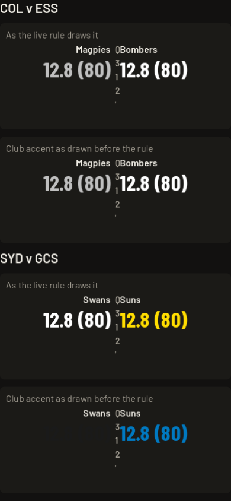
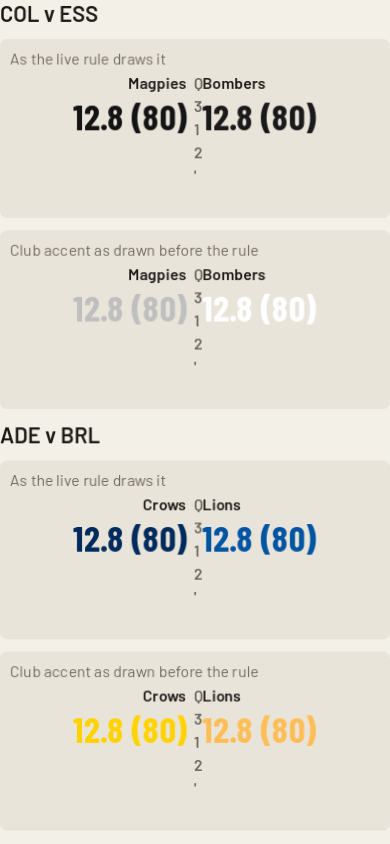
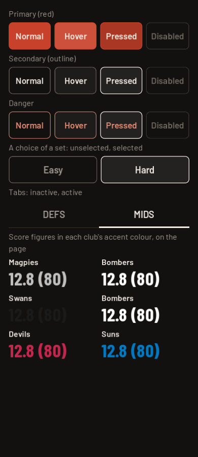

# STYLE-03 pairings: club score colours on the scoreboard

Measurement only, as evidence for the art agent and the director. No colour is changed
and nothing here is a proposal. Source: `UiKit.contrast` and `UiKit.score_colour` (the
#407 rule) on main, every club's three colours against the scoreboard surface
(`UiKit.PANEL`: #1b1a17 in dark mode, #e9e4da in light).
WCAG contrast, 4.5:1 for text. Scratch script, not committed.

## What was found

- **Under the live rule, no pairing is under 4.5:1.** `score_colour` takes the club's
  accent, else its second colour, else its first, whichever first reaches 4.5:1 on the
  panel, else plain text. All 40 pairings (20 clubs, dark and light) come out at 5.3:1
  or better. Lowest: Fremantle in dark 5.33 (accent), Brisbane in light 5.86
  (second colour), West Bulldogs in light 5.95 (second colour).
- **The club accent alone, before the rule, is under 4.5:1 for 22 of 40 pairings**:
  3 in dark (Gold Coast 3.73, Sydney 1.00, Tasmania 3.06) and 19 in light (Adelaide 1.15,
  Brisbane 1.31, Carlton 1.95, Collingwood 1.45, Essendon 1.27, Fremantle 2.58, Geelong
  1.69, Gold Coast 3.68, GWS 1.27, Hawthorn 1.27, Melbourne 1.27, North 1.22, Port
  1.44, Richmond 1.27, St Kilda 1.27, West Coast 1.27, Western Bulldogs 1.27,
  Tasmania 4.49, Canberra 1.46). This is the 1.3:1 white score on the light panel that #401 found.
- **The rule's price:** in dark 17 clubs keep their accent and 3 fall to their second
  colour; in light only 1 keeps its accent, 12 use their primary, 6 their second colour,
  and 1 (Gold Coast, none of its three colours reaches 4.5:1 on the light panel) falls
  back to plain text.
- Not measured here: any other place a club colour is drawn (the momentum bar, guernsey
  chips, ladder rows). The rule is applied only to the live score.

## Captures (390 wide, offscreen)

Scoreboard rows are rebuilt from the same UiKit calls as the live scoreboard (panel,
club short name, `UiKit.figure` at 30), with a stand-in clock, so only the score
colours matter; the clock wraps in the narrow middle column. Each pairing is shown twice: as the live rule draws it, and the club accent
as drawn before the rule.

- COL v ESS (the audited case) and the two worst raw pairings, Sydney v Gold Coast in
  dark and Adelaide v Brisbane in light:
  
  
- The shared controls in each state (normal, hover, pressed, disabled, selected, danger,
  tabs) and three score fixtures, from `capture_component_states.gd`, in dark:
  

## Every pairing, dark (surface #1b1a17)

| club | primary | secondary | accent | accent on panel | drawn today | on panel |
|---|---|---|---|---|---|---|
| ADE | #002b5c | #e21937 | #ffd200 | 11.99 | accent | 11.99 |
| BRL | #a30046 | #0055a3 | #fdbe57 | 10.51 | accent | 10.51 |
| CAR | #0b1f4b | #ffffff | #7fa7e0 | 7.05 | accent | 7.05 |
| COL | #141414 | #ffffff | #bfbfbf | 9.46 | accent | 9.46 |
| ESS | #1a1a1a | #cc2031 | #ffffff | 17.40 | accent | 17.40 |
| FRE | #2a0d54 | #ffffff | #a67fc1 | 5.33 | accent | 5.33 |
| GEE | #002b5c | #ffffff | #8fb4e3 | 8.13 | accent | 8.13 |
| GCS | #e02112 | #ffdd00 | #0079c1 | 3.73 | secondary | 12.92 |
| GWS | #f47920 | #3c3c3b | #ffffff | 17.40 | accent | 17.40 |
| HAW | #4d2004 | #fbbf15 | #ffffff | 17.40 | accent | 17.40 |
| MEL | #0a1f44 | #cc2031 | #ffffff | 17.40 | accent | 17.40 |
| NTH | #1a3b8e | #ffffff | #c4d1e5 | 11.27 | accent | 11.27 |
| PAD | #008aab | #1a1a1a | #c0c0c0 | 9.56 | accent | 9.56 |
| RIC | #ffd200 | #1a1a1a | #ffffff | 17.40 | accent | 17.40 |
| STK | #ed1b2f | #1a1a1a | #ffffff | 17.40 | accent | 17.40 |
| SYD | #e1251b | #ffffff | #1a1a1a | 1.00 | secondary | 17.40 |
| WCE | #003087 | #f2a900 | #ffffff | 17.40 | accent | 17.40 |
| WBD | #bd002b | #20539d | #ffffff | 17.40 | accent | 17.40 |
| TAS | #2c5530 | #e8d44d | #c2274d | 3.06 | secondary | 11.56 |
| CANB | #1b3b6f | #ffffff | #f5b301 | 9.39 | accent | 9.39 |

## Every pairing, light (surface #e9e4da)

| club | primary | secondary | accent | accent on panel | drawn today | on panel |
|---|---|---|---|---|---|---|
| ADE | #002b5c | #e21937 | #ffd200 | 1.15 | primary | 11.05 |
| BRL | #a30046 | #0055a3 | #fdbe57 | 1.31 | secondary | 5.86 |
| CAR | #0b1f4b | #ffffff | #7fa7e0 | 1.95 | primary | 12.63 |
| COL | #141414 | #ffffff | #bfbfbf | 1.45 | primary | 14.54 |
| ESS | #1a1a1a | #cc2031 | #ffffff | 1.27 | primary | 13.74 |
| FRE | #2a0d54 | #ffffff | #a67fc1 | 2.58 | primary | 12.91 |
| GEE | #002b5c | #ffffff | #8fb4e3 | 1.69 | primary | 11.05 |
| GCS | #e02112 | #ffdd00 | #0079c1 | 3.68 | TEXT | 13.68 |
| GWS | #f47920 | #3c3c3b | #ffffff | 1.27 | secondary | 8.72 |
| HAW | #4d2004 | #fbbf15 | #ffffff | 1.27 | primary | 10.88 |
| MEL | #0a1f44 | #cc2031 | #ffffff | 1.27 | primary | 12.82 |
| NTH | #1a3b8e | #ffffff | #c4d1e5 | 1.22 | primary | 8.05 |
| PAD | #008aab | #1a1a1a | #c0c0c0 | 1.44 | secondary | 13.74 |
| RIC | #ffd200 | #1a1a1a | #ffffff | 1.27 | secondary | 13.74 |
| STK | #ed1b2f | #1a1a1a | #ffffff | 1.27 | secondary | 13.74 |
| SYD | #e1251b | #ffffff | #1a1a1a | 13.74 | accent | 13.74 |
| WCE | #003087 | #f2a900 | #ffffff | 1.27 | primary | 9.35 |
| WBD | #bd002b | #20539d | #ffffff | 1.27 | secondary | 5.95 |
| TAS | #2c5530 | #e8d44d | #c2274d | 4.49 | primary | 6.77 |
| CANB | #1b3b6f | #ffffff | #f5b301 | 1.46 | primary | 8.72 |

Columns: "accent on panel" is the contrast of the club's accent against the panel;
"drawn today" is which colour the rule picks; "on panel" is that colour's contrast.
