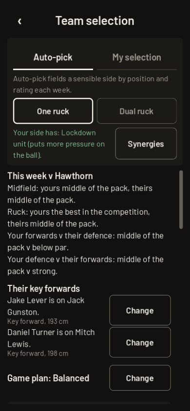
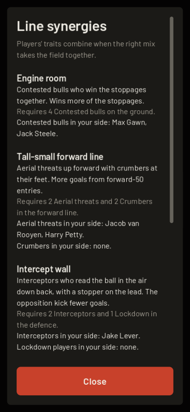

# Where the UI shows synergies and traits today

Evidence for the director's synergy question. A list of what exists on main as of
2026-10-06, with no design proposals. Source: `grep` of `scripts/ui` and a capture of
the Selection screen.

## Synergies (a mix of traits in a line)

| Where | File and function | What it shows |
|---|---|---|
| Team selection, under the auto-pick controls | `SelectionScene._synergy_view` | One line: "Your side has: <synergy and what it does>." for the synergies your 18 switch on, or "No line synergies in this side." No count of how close an unswitched one is (the code comment says so on purpose). |
| Team selection, the Synergies button | `SelectionScene._show_synergies` | A sheet listing every synergy: its name, an "On" mark if your side has it, what it is and does, exactly what it needs (`Traits.requirement_text`), and who in your 18 carries each trait it needs ("Contested bulls in your side: ..." or "none"). |
| Match, quarter-break coach box under More calls | `MatchScene._show_coach_box` through `_synergy_line` | One muted line: "Your synergies: <names with effect>. Theirs: <names or none>." |
| Full-time summary | `MatchScene._ft_summary` through `MatchNotes.synergy_lines` | "Your synergies": up to 3 lines, each the stat it showed up in from this match (engine room: clearances; tall-small: goals from inside 50s; intercept wall: their goals from inside 50s; lockdown unit: pressure rating; supply line: inside 50s). Running machine has no line. |
| Stat Guide | `StatGuide` entry "Traits and synergies" | A paragraph: a standout stat earns a trait (up to two, plus Hothead), traits come and go with the stats, the right mix in a line switches on a synergy (Engine room, Tall-small forward line). It says "the Team screen shows yours and the nearest to finish"; the Team screen as built shows the ones that are on and the full rules, not the nearest to finish. |

## Traits (one player)

| Where | File and function | What it shows |
|---|---|---|
| Team selection, each player row | `SelectionScene._row` through `UiKit.trait_chips` | One quiet line of trait names after who he is. |
| Training, player detail | `TrainingScene._detail_panel` through `UiKit.trait_chips` | The same trait line. |
| Training, player detail | `TrainingScene._detail_panel` through `Traits.near` | One hint: "<n> <stat> from <trait>: <what it does>" for the closest trait he could earn. |
| Player sheet | `PlayerSheet.open` | Each trait as "Name. scouting line", red for a bad trait (Hothead). |
| Draft, the player row | `DraftScene._player_row` | Trait names appended to the row's detail line. |
| Draft, the player card | `DraftScene._open_player` | Each trait as "Name. scouting line", red for a bad trait. |
| Create a player | `ClubForgeScene._toggles` | A picker for up to two traits, never one already picked on the other side. |
| Match goal feed | `MatchNotes.story_feed_line`, `MatchScene._goal_row` | A Big-game player's first goal when he lifts, once a side a match ("lifts when it matters"); a Crumber's goal off the deck is labelled "Crumbing goal". |
| Coach report | `CoachReport` (`"traits"` topic) | Listed as the "traits and synergies" topic; no screen of its own. |

## The Selection screen as it is

Captured offscreen at 390 wide, dark mode, a fresh Melbourne career in 2027 (Lockdown unit
is on). The synergy line sits in the auto-pick panel with the Synergies button beside it.

The Synergies sheet (the button opened):

